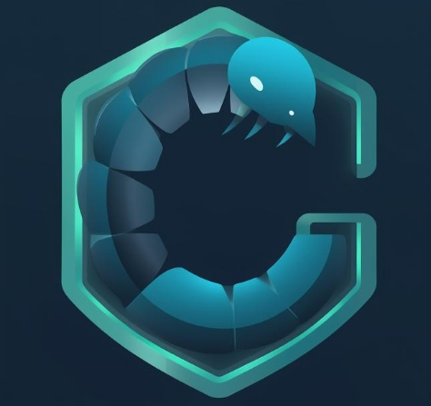

# C3NT1P3D3 Security Scanner Framework

[](https://github.com/n0m4official/C3NT1P3D3/releases)
[](https://github.com/n0m4official/C3NT1P3D3)
[](LICENSE)
[](https://isocpp.org/)
[](https://github.com/n0m4official/C3NT1P3D3)
[](https://deepwiki.com/n0m4official/C3NT1P3D3)




A research-focused vulnerability detection framework implemented in modern C++17. Designed for authorized security testing, education, and research.

Status: Prototype / Research — Solo-maintained by a college student (n0m4official). See SECURITY.md for responsible-disclosure details and safety guidance.

---

## Overview

C3NT1P3D3 is a detection-first security scanning framework that bundles multiple vulnerability detectors, native protocol logic, and MITRE ATT&CK mapping to help with assessment, reporting, and threat-contextualization. It is intended for authorized penetration testing, academic research, and learning.

This repository is maintained as a solo project by the author listed in the Maintainer section. The project is not a commercial product and should be treated as research/prototype quality unless otherwise noted.

Key characteristics:
- Detection modules across network, web, cloud, and system domains
- MITRE ATT&CK mapping for findings to assist SOC workflows
- Simulation mode to validate behavior without sending traffic
- Cross-platform support: Windows and Linux builds
- Language: C++ (C++17), build system: CMake

---

## Important Legal & Safety Notice

Use of this tool requires explicit authorization.

- Obtain written permission before scanning systems you do not own.
- Unauthorized scanning may violate laws (criminal and civil) in many jurisdictions.
- The author is not responsible for misuse of the software.
- This project contains detection logic only; it does not include exploit payloads by design.

By running this software, you confirm you are authorized to perform the scans you initiate.

For full responsible-disclosure process and security contact, see SECURITY.md.

---

## Quick Start (Simulation)

Simulation mode exercises detection logic without performing real network traffic — use it first.

```bash
# Safe testing (no network traffic)
./C3NT1P3D3-Comprehensive 192.168.1.0/24 --simulation --output test.json
```

---

## System Requirements

- OS: Windows 10/11 (x64) or Linux (x64)
- Memory: 2 GB minimum (4 GB recommended)
- Disk: ~100 MB
- Compiler: Visual Studio 2022 (Windows) or GCC 7+/Clang (Linux)
- CMake 3.15+
- Some operations may require administrator/root privileges

---

## Build Instructions

Windows (Visual Studio)
```powershell
git clone https://github.com/n0m4official/C3NT1P3D3.git
cd C3NT1P3D3
cmake -S . -B build -G "Visual Studio 17 2022" -A x64
cmake --build build --config Release --target C3NT1P3D3-Comprehensive
.\build\Release\C3NT1P3D3-Comprehensive.exe --help
```

Linux
```bash
git clone https://github.com/n0m4official/C3NT1P3D3.git
cd C3NT1P3D3
mkdir build && cd build
cmake .. -DCMAKE_BUILD_TYPE=Release
make -j$(nproc)
./C3NT1P3D3-Comprehensive --help
```

Pre-built releases are available on the Releases page (when published).

---

## Basic Usage

```bash
# Simulation mode (safe)
C3NT1P3D3-Comprehensive 192.168.1.0/24 --simulation --output test.json

# Real scan (authorized)
C3NT1P3D3-Comprehensive 192.168.1.0/24 --output results.json

# Tuned scan
C3NT1P3D3-Comprehensive 192.168.1.0/24 --threads 5 --rate-limit 50 --output scan.json
```

See `--help` for full CLI options.

---

## Capabilities (summary)

- ~37 detection modules: network (SMB/RDP/SSH/FTP), web (SQLi, XSS, SSRF, XXE, Log4Shell, etc.), cloud metadata checks, container misconfig checks, TLS/SSL checks
- MITRE ATT&CK mapping and mitigation guidance for reported issues
- Output formats: JSON, XML, plain text
- Safety features: IP-range blocking, private network detection, explicit public-scan confirmation, simulation mode, rate limiting, logging, emergency stop

---

## Maturity & Limitations

- Maturity: Prototype / Research. Not third-party audited or certified.
- Intended use: authorized testing, education, and research.
- Not recommended for unattended production scans or high-risk environments without review.
- Some protocol implementations are intentionally minimal for detection; they are not full production-grade protocol stacks.
- If you need production-grade tooling, consider this code as a foundation or educational reference.

---

## Responsible Disclosure

If you discover any security problems in this project or in systems tested with it, follow the process documented in SECURITY.md.

---

## Contributing

Contributions are welcome and appreciated. Suggested areas:
- New detection modules
- Protocol improvements
- Tests / CI
- Documentation & examples

Process:
1. Fork the repository
2. Create a feature branch (e.g., `feature/new-detector`)
3. Include tests or examples where applicable
4. Open a pull request with a clear description and rationale

See CONTRIBUTING.md for details.

---

## Maintainer

n0m4official — college student and solo maintainer  
This repository is a personal project maintained in spare time. I welcome feedback and PRs — please be patient with review times.

Profile: https://github.com/n0m4official

---

## License

This project is distributed under the MIT License. See LICENSE for details. Using the software still requires you to obtain authorization before scanning third-party systems.

---

## Acknowledgements

Thanks to the open security and standards communities, including MITRE ATT&CK and the C++ community, for guidance and resources.

---

## Contact

- Repository: https://github.com/n0m4official/C3NT1P3D3  
- Security & disclosure: see SECURITY.md
